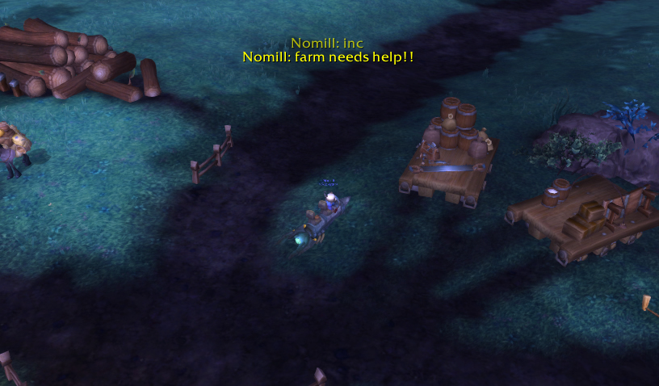

# Telepath

Display some chat message as "raid warning".

This would be useful to avoid missing some important messages in combat.

Options:

- Select source channels: Guild, Party or Instance(Raid)
- specific Nickname (e.g. set no-VC member name)
- Keyword filter (e.g. set "inc")
- Output pattern: "Raid Warning style"(default), Floating combat text style and more.
